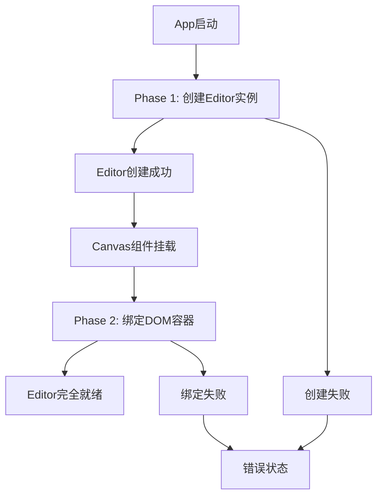

# ZHGU Editor - 图形设计编辑器

基于 React + TypeScript + Vite 构建的现代化图形设计编辑器，类似 Figma 的界面和交互体验。

## 🎉 最新进展 (2024-12-19)

### 核心架构重构完成
今天完成了从模拟数据到真实@zhgu/editor集成的重大重构，实现了完整的数据驱动架构：

#### 1. **TypeScript配置优化**
- ✅ 简化TS配置：从3个配置文件合并为1个，继承monorepo根配置
- ✅ 修复装饰器编译问题：从SWC切换到标准React插件支持@autobind

#### 2. **两阶段初始化架构**
- ✅ **Phase 1**: App启动时创建Editor实例（无DOM依赖）
- ✅ **Phase 2**: Canvas挂载后绑定DOM容器完成初始化
- ✅ 完整的状态管理：IDLE → CREATING → WAITING_CANVAS → READY → ERROR
- ✅ 错误处理和加载状态完善

#### 3. **真实Editor API集成**
- ✅ **完全移除模拟数据**：删除所有Mock Page/Layer接口
- ✅ **真实数据获取**：
  - `getPages()` - 获取editor.pages真实页面数据
  - `getCurrentPage()` - 获取editor.scene.currentPage
  - `getSelectedNodes()` - 获取editor选中节点
- ✅ **Editor操作代理**：selectNodes(), clearSelection(), undo/redo等

#### 4. **组件架构重构**
- ✅ **LeftPanel重构**：支持递归图层树，基于IBaseNode真实数据
- ✅ **Canvas简化**：移除模拟渲染，editor完全控制画布
- ✅ **Store优化**：Zustand性能优势，统一状态管理
- ✅ **类型安全**：正确导入IBaseNode，类型断言处理兼容性

#### 5. **开发者体验提升**
- ✅ **DebugPanel组件**：统一调试面板，显示鼠标坐标、画布状态、选择信息等
- ✅ **快捷键支持**：L键切换调试模式，完整快捷键系统
- ✅ **错误边界**：完善的错误处理和用户提示

### 当前架构优势
- 🚀 **真实数据驱动**：UI完全基于editor的真实数据，无模拟逻辑
- ⚡ **高性能**：Zustand状态管理，避免Context性能问题
- 🔧 **完整初始化**：两阶段设计解决DOM依赖，确保editor正确绑定
- 🌳 **递归图层**：支持复杂嵌套结构，真实反映设计文档层级
- 🛡️ **类型安全**：TypeScript严格检查，运行时错误处理完善

## UI 需求详细描述

根据设计稿分析，本编辑器需要实现以下核心界面组件：

### 1. 整体布局
- **三栏式布局**：左侧层级面板 + 中央画布区域 + 右侧属性面板
- **顶部工具栏**：包含各种设计工具和操作选项
- **色彩方案**：主要采用蓝白配色，现代化扁平设计风格

### 2. 左侧层级面板
- **页面管理区域**
  - 显示"页数: 1"
  - 页面列表，支持页面切换
  - 页面添加/删除功能
- **图层树结构**
  - 层级结构显示（缩进表示父子关系）
  - 图层重命名功能
  - 图层可见性开关（眼睛图标）
  - 图层锁定功能
  - 拖拽排序支持

### 3. 顶部工具栏
- **文件操作**：个人文件、无标题等文件状态显示
- **设计工具集**：
  - 选择工具（箭头）
  - 移动工具
  - 矩形工具
  - 文本工具
  - AI工具（New标识）
  - 其他几何图形工具
- **视图控制**：缩放比例显示（100%）
- **协作功能**：分享按钮、用户头像等

### 4. 中央画布区域
- **无限画布**：支持拖拽平移和缩放操作
- **网格/标尺系统**：辅助定位和对齐
- **图形元素渲染**：支持各种几何图形的显示和编辑
- **选择框和控制点**：选中元素时显示变换控制点

### 5. 右侧属性面板
- **高布局属性**：针对选中元素的属性配置
- **页面颜色配置**：背景色等页面级别设置
- **导出功能**：支持多种格式导出
- **动态属性面板**：根据选中元素类型显示不同属性

## 🏗️ 技术架构详解

### Editor初始化流程

#### 两阶段初始化设计原理
由于@zhgu/editor需要DOM容器才能完成初始化，但React组件的渲染时序无法保证，因此设计了两阶段初始化：



#### 详细初始化时序

```typescript
// 1. App组件启动时 (useEffect)
App.tsx: useEffect(() => {
  createEditor(); // 触发Phase 1
}, []);

// 2. Phase 1: Zustand Store中创建Editor实例
store.createEditor = async () => {
  set({ initState: EditorInitState.CREATING });
  
  try {
    const fileData = createHelloWorldFileData();
    const editor = new Editor(fileData); // 创建不需要DOM
    
    set({ 
      editor,
      initState: EditorInitState.WAITING_CANVAS 
    });
  } catch (error) {
    set({ 
      initState: EditorInitState.ERROR,
      initError: error.message 
    });
  }
};

// 3. Canvas组件检测状态变化并触发Phase 2
Canvas.tsx: useEffect(() => {
  if (initState === EditorInitState.WAITING_CANVAS && canvasContainerRef.current) {
    bindCanvas('app'); // 触发Phase 2
  }
}, [initState, bindCanvas]);

// 4. Phase 2: 绑定DOM容器
store.bindCanvas = async (canvasId: string) => {
  const { editor } = get();
  
  try {
    await editor.init(canvasId); // 需要DOM的初始化
    
    set({ initState: EditorInitState.READY });
  } catch (error) {
    set({ 
      initState: EditorInitState.ERROR,
      initError: error.message 
    });
  }
};
```

### Zustand数据流动机制

#### 状态管理架构
```typescript
interface EditorStore {
  // 核心状态
  editor: Editor | null;           // Editor实例
  initState: EditorInitState;      // 初始化状态
  initError: string | null;        // 错误信息
  
  // UI状态  
  activeTool: ToolType;           // 当前工具
  canvasZoom: number;             // 画布缩放
  canvasOffsetX: number;          // 画布偏移X
  canvasOffsetY: number;          // 画布偏移Y
  debugMode: boolean;             // 调试模式
  
  // 数据获取方法 (无副作用)
  getPages: () => IBaseNode[];
  getCurrentPage: () => IBaseNode | null;
  getSelectedNodes: () => IBaseNode[];
  
  // 操作方法 (有副作用)
  selectNodes: (nodes: IBaseNode[]) => void;
  clearSelection: () => void;
  undoHistory: () => void;
  redoHistory: () => void;
}
```

#### 数据流动路径

```typescript
// 1. 读取数据流 (Editor → Store → Component)
Editor实例 → Store.getPages() → LeftPanel.pages
Editor实例 → Store.getCurrentPage() → LeftPanel.currentPage  
Editor实例 → Store.getSelectedNodes() → LeftPanel.selectedNodes

// 具体实现
const LeftPanel = () => {
  const { getPages, getCurrentPage, getSelectedNodes } = useEditorStore();
  
  // 每次渲染时获取最新数据
  const pages = getPages();           // 调用 editor.pages
  const currentPage = getCurrentPage(); // 调用 editor.scene.currentPage
  const selectedNodes = getSelectedNodes(); // 调用 editor.selectedNodes
  
  return <LayerTree nodes={pages.children} />;
};

// 2. 操作数据流 (Component → Store → Editor)
LeftPanel.handleSelect → Store.selectNodes() → Editor.selectedNodes
LeftPanel.handleClear → Store.clearSelection() → Editor.clearSelection()

// 具体实现
const handleSelectNode = (node: IBaseNode, multi: boolean) => {
  if (multi) {
    selectNodes([...selectedNodes, node]); // 触发store方法
  } else {
    selectNodes([node]); // 触发store方法
  }
};

// Store中的操作代理
selectNodes: (nodes: IBaseNode[]) => {
  const { editor } = get();
  if (!editor) return;
  
  // 调用editor API (具体API待确认)
  editor.setSelectedNodes?.(nodes);
  
  // 无需更新store状态，因为下次getSelectedNodes()会获取最新值
},
```

### 事件驱动的状态同步

#### Editor事件监听机制 (待实现)
```typescript
// 在bindCanvas成功后注册事件监听
store.bindCanvas = async (canvasId: string) => {
  const { editor } = get();
  await editor.init(canvasId);
  
  // 注册editor事件监听 (假设API)
  editor.on('selectionChange', (selectedNodes) => {
    // Editor选择变化时，自动触发组件更新
    // 由于使用getter模式，组件会自动获取最新值
    console.log('Selection changed:', selectedNodes);
  });
  
  editor.on('pageChange', (newPage) => {
    // 页面切换时的事件处理
    console.log('Page changed:', newPage);
  });
  
  editor.on('nodeUpdate', (updatedNode) => {
    // 节点属性更新时的事件处理
    console.log('Node updated:', updatedNode);
  });
  
  set({ initState: EditorInitState.READY });
};
```

#### 组件自动更新机制
```typescript
// Zustand的订阅机制确保组件自动更新
const LeftPanel = () => {
  // 当initState变化时，组件自动重新渲染
  const { initState, getPages } = useEditorStore();
  
  // 当Editor状态变化时，getter返回新值触发重新渲染
  const pages = getPages(); // 每次渲染都调用，获取最新数据
  
  if (initState !== EditorInitState.READY) {
    return <LoadingState />; // 状态变化自动切换UI
  }
  
  return <LayerTree nodes={pages} />;
};
```

### 性能优化策略

#### 1. Getter模式避免冗余状态
```typescript
// ❌ 旧方案：在store中维护冗余状态
interface OldStore {
  pages: Page[];        // 冗余状态，需要手动同步
  selectedIds: string[]; // 冗余状态，需要手动同步
}

// ✅ 新方案：Getter模式，直接从Editor获取
interface NewStore {
  getPages: () => IBaseNode[];        // 直接调用editor.pages
  getSelectedNodes: () => IBaseNode[]; // 直接调用editor.selectedNodes
}
```

#### 2. 按需订阅和局部更新
```typescript
// 组件只订阅需要的状态片段
const DebugPanel = () => {
  const { debugMode } = useEditorStore(); // 只订阅debugMode
  
  if (!debugMode) return null; // 早期返回，避免无效渲染
};

const LeftPanel = () => {
  const { initState, getPages } = useEditorStore(); // 只订阅需要的字段
  
  const pages = useMemo(() => {
    if (initState !== EditorInitState.READY) return [];
    return getPages(); // 只在就绪状态才调用
  }, [initState, getPages]);
};
```

#### 3. 操作防抖和批量更新
```typescript
// 防抖选择操作，避免频繁API调用
const debouncedSelectNodes = useMemo(
  () => debounce((nodes: IBaseNode[]) => {
    selectNodes(nodes);
  }, 16), // 60fps
  [selectNodes]
);
```

### 错误处理和边界保护

#### 初始化错误处理
```typescript
// 每个阶段都有错误捕获
store.createEditor = async () => {
  set({ initState: EditorInitState.CREATING });
  
  try {
    const editor = new Editor(fileData);
    set({ editor, initState: EditorInitState.WAITING_CANVAS });
  } catch (error) {
    console.error('Editor创建失败:', error);
    set({ 
      initState: EditorInitState.ERROR,
      initError: `创建失败: ${error.message}` 
    });
  }
};
```

#### 运行时错误保护
```typescript
// Getter方法中的错误保护
getPages: () => {
  const { editor, initState } = get();
  
  // 状态检查
  if (!editor || initState !== EditorInitState.READY) {
    return [];
  }
  
  // API调用保护
  try {
    return (editor.pages || []) as IBaseNode[];
  } catch (error) {
    console.error('获取页面数据失败:', error);
    return [];
  }
},
```

### 调试和监控

#### 状态变化监控
```typescript
// 开发环境下的状态监控
if (process.env.NODE_ENV === 'development') {
  useEditorStore.subscribe((state, prevState) => {
    if (state.initState !== prevState.initState) {
      console.log(`InitState: ${prevState.initState} → ${state.initState}`);
    }
    
    if (state.debugMode !== prevState.debugMode) {
      console.log(`DebugMode: ${prevState.debugMode} → ${state.debugMode}`);
    }
  });
}
```

#### DebugPanel实时监控
```typescript
const DebugPanel = () => {
  const { 
    initState, canvasZoom, canvasOffsetX, canvasOffsetY,
    getSelectedNodes 
  } = useEditorStore();
  
  // 实时显示所有关键状态
  return (
    <div className="debug-panel">
      <div>状态: {initState}</div>
      <div>缩放: {Math.round(canvasZoom * 100)}%</div>
      <div>偏移: ({canvasOffsetX}, {canvasOffsetY})</div>
      <div>选中: {getSelectedNodes().length} 个</div>
    </div>
  );
};
```

这种架构设计的优势：
- 🎯 **单一数据源**：Editor是唯一的数据源，UI只是反映
- 🚀 **高性能**：避免冗余状态，减少不必要的更新
- 🛡️ **类型安全**：TypeScript严格检查，运行时保护
- 🔧 **易调试**：清晰的数据流，完善的错误处理
 - 📈 **可扩展**：新功能只需添加getter和操作方法

## 🚀 后续功能开发流程

### 当前开发基础
基于完成的架构重构，现在具备了：
- ✅ 真实Editor实例和数据访问
- ✅ 完整的初始化流程和错误处理
- ✅ 递归图层树结构支持
- ✅ 统一的状态管理和操作代理
- ✅ 开发调试工具完善

### 下一步开发重点

#### 1. **完善Editor操作集成 (高优先级)**
```typescript
// 需要实现的Editor API调用
- 图层可见性切换: node.setVisible()
- 图层锁定: node.setLocked() 
- 图层重命名: node.setName()
- 图层删除: editor.deleteNode()
- 页面切换: editor.switchPage()
- 页面添加: editor.addPage()
```

#### 2. **工具栏功能实现 (中优先级)**
```typescript
// 工具切换需要调用Editor API
- 选择工具: editor.setTool('select')
- 矩形工具: editor.setTool('rectangle')  
- 文本工具: editor.setTool('text')
- 撤销重做: editor.undo() / editor.redo()
```

#### 3. **属性面板数据绑定 (中优先级)**
```typescript
// RightPanel需要显示选中节点的真实属性
- 位置属性: selectedNode.x, selectedNode.y
- 尺寸属性: selectedNode.width, selectedNode.height
- 样式属性: selectedNode.fillColor, selectedNode.strokeColor
```

#### 4. **画布交互增强 (低优先级)**
```typescript
// Canvas组件主要负责事件传递给Editor
- 鼠标事件: 传递给editor处理
- 键盘事件: 传递给editor处理  
- 缩放平移: editor.setZoom(), editor.setOffset()
```

### 开发模式建议
1. **API优先**：先查看editor提供的方法，再实现UI功能
2. **渐进集成**：每次集成一个功能点，确保稳定性
3. **错误处理**：每个editor调用都要有try-catch和用户提示
4. **类型安全**：优先完善@zhgu/editor的类型导出

## 开发 Roadmap

### ✅ 已完成阶段

#### Phase 1: 基础架构搭建 
- [x] 项目初始化 (React + TypeScript + Vite + tailwindcss)
- [x] 整体布局框架搭建
  - [x] 三栏式布局组件
  - [x] 响应式设计基础
- [x] 基础组件库建设
  - [x] 基础UI组件
  - [x] 图标库整理 (lucide-react)
- [x] 状态管理方案
  - [x] Zustand 集成
  - [x] 全局状态结构设计

#### Phase 2: Editor集成重构 
- [x] 真实@zhgu/editor集成
- [x] 两阶段初始化架构
- [x] TypeScript配置优化
- [x] 数据模型完全重构 (移除所有mock数据)

#### Phase 3: 核心组件完成
- [x] LeftPanel (页面管理 + 递归图层树)
- [x] Canvas (编辑器渲染容器 + 状态管理)  
- [x] TopBar + Toolbar (基础布局)
- [x] RightPanel (基础布局)
- [x] DebugPanel (开发调试工具)

### 🔄 待完成阶段

#### Phase 4: Editor操作功能实现 (优先级：高)
- [ ] 图层操作集成
  - [ ] 图层可见性切换 (调用editor API)
  - [ ] 图层锁定/解锁 (调用editor API)
  - [ ] 图层重命名 (调用editor API)
  - [ ] 图层删除 (调用editor API)
- [ ] 页面操作集成
  - [ ] 页面切换逻辑 (调用editor API)
  - [ ] 页面增删功能 (调用editor API)
- [ ] 选择操作完善
  - [ ] 多选功能优化
  - [ ] 选择状态同步

#### Phase 5: 工具栏功能实现 (优先级：中)
- [ ] 工具切换集成
  - [ ] 选择工具激活 (editor.setTool)
  - [ ] 矩形工具激活 (editor.setTool)
  - [ ] 文本工具激活 (editor.setTool)
  - [ ] 工具状态同步显示
- [ ] 编辑操作集成
  - [ ] 撤销/重做 (editor.undo/redo)
  - [ ] 复制/粘贴 (editor API)
  - [ ] 删除操作 (editor API)
- [ ] 视图控制
  - [ ] 缩放控制集成
  - [ ] 视图重置功能

#### Phase 6: 属性面板数据绑定 (优先级：中)
- [ ] 动态属性显示
  - [ ] 根据选中节点显示真实属性
  - [ ] 位置尺寸属性绑定
  - [ ] 样式属性绑定
- [ ] 属性编辑功能
  - [ ] 属性值修改 (调用editor API)
  - [ ] 实时预览更新
- [ ] 页面属性设置
  - [ ] 背景色设置
  - [ ] 页面尺寸配置

#### Phase 7: 交互体验优化 (优先级：低)
- [ ] 键盘快捷键完善
  - [x] 基础快捷键支持 (已完成)
  - [ ] 更多编辑快捷键
- [ ] 性能优化
  - [ ] 大量图层时的虚拟滚动
  - [ ] 图形渲染性能优化
- [ ] 用户体验提升
  - [x] 加载状态处理 (已完成)
  - [x] 错误边界处理 (已完成)
  - [ ] 响应式适配完善

## 技术栈

- **前端框架**：React 18+ with TypeScript
- **构建工具**：Vite
- **状态管理**：Redux Toolkit / Zustand
- **样式方案**：CSS Modules / Styled Components
- **图形渲染**：可以直接使用 packages/editor/example的example去写
- **组件库**：自研基础组件
- **工具链**：ESLint + Prettier,使用monorepo基建中的即可

## 核心要求

1. **高还原度**：UI 和交互需要高度还原设计稿
2. **响应式设计**：支持不同屏幕尺寸
3. **性能优化**：流畅的用户体验，60fps 操作响应
4. **代码质量**：TypeScript 严格模式，完善的类型定义
5. **可扩展性**：模块化设计，便于后续功能扩展

## 开发规范

- 所有功能函数暂时只需要实现空方法，函数体内添加 `console.log` 日志
- 组件采用函数式组件 + Hooks 的开发模式
- 严格遵循 TypeScript 类型检查
- 使用统一的代码格式化和 lint 规则

## 快捷键

- **L** - 切换调试面板
- **?** - 显示快捷键帮助
- **Esc** - 关闭弹窗/取消操作

## 安装和运行

```bash
# 安装依赖
pnpm install

# 启动开发服务器
pnpm dev

# 构建生产版本
pnpm build
```
